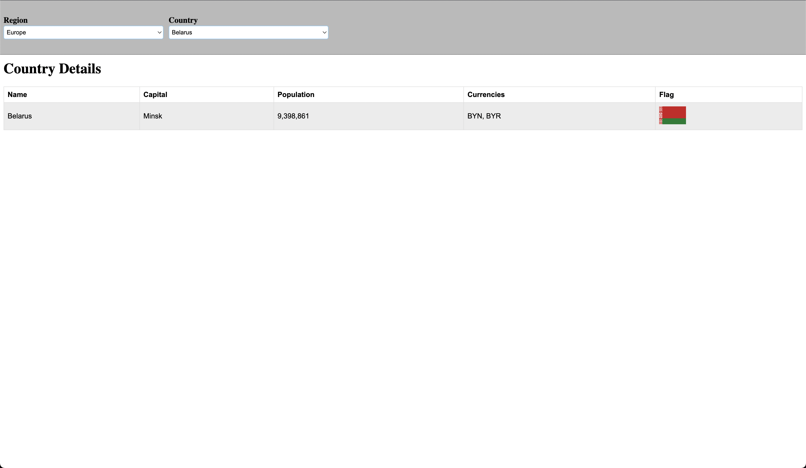

# RegionsCountries

This project allows you to retrieve some details of a target country.

Countries are filtered based on region. Using the controls at the top, you can select a region, which will then enable you to choose a country from that region. Once you select a country, its details will be displayed in a table.

The countries are only loaded once a region is selected, and only the first time that region is selected in the session.

## Running the project

Run `npm install` to download depenedancies

Run `ng serve` for a dev server. Navigate to `http://localhost:4200/`.

## Running unit tests

Run `ng test` to execute the unit tests via [Karma](https://karma-runner.github.io).

## Additional features

In a real world scenario some logging and error handling systems should be put in place to monitor and manage unexpected problems